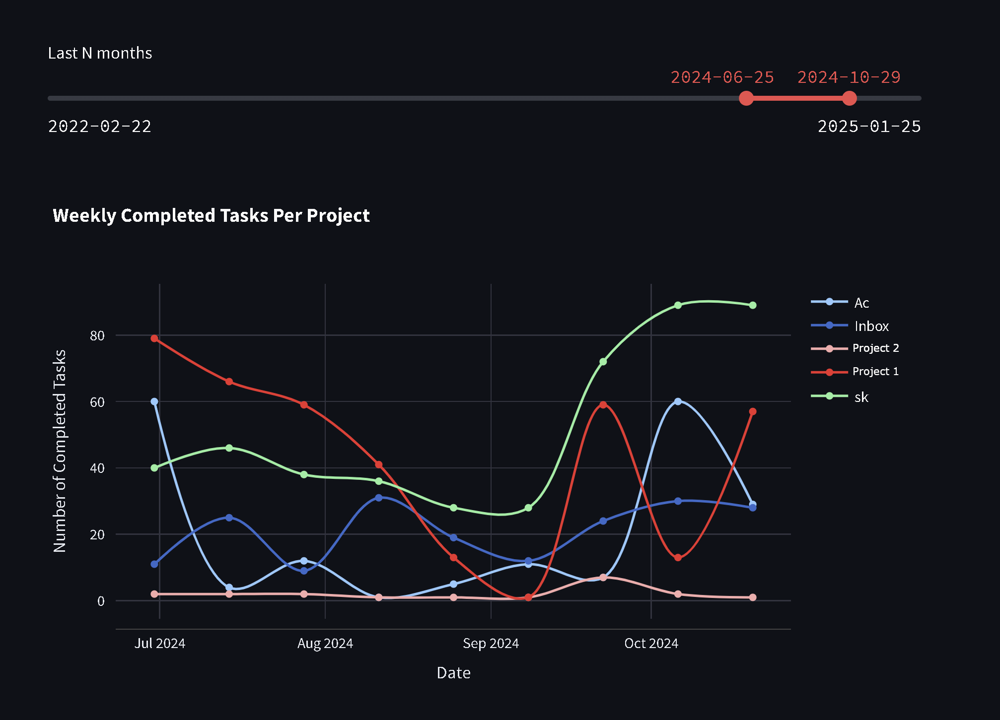

# Todoist Summary Plugin

This tool provides insights into your Todoist activity by analyzing task events (e.g., added, completed, updated) and visualizing them through interactive plots. It helps you track productivity trends and project progress over time.

---

## Features
- **Activity Tracking**: Fetches and summarizes Todoist activity data (e.g., tasks added, completed, updated).
- **Interactive Visualizations**: Displays cumulative task completion trends and project-specific activity.
- **Customizable Time Range**: Allows you to analyze data for specific time periods.

---

## Usage

### 1. Update Activity Database
To fetch and update your Todoist activity data, run:
```bash
python3 activity.py
```

This will:
- Fetch the latest activity data from Todoist.
- Summarize the activity (e.g., tasks added, completed, updated).
- Save the data locally for visualization.

Example output:
```
2025-01-25 22:17:50.241 | INFO     | Fetched 876 events
2025-01-25 22:17:51.194 | INFO     | Added 18 new events, current size: 27119
2025-01-25 22:17:52.787 | INFO     | Summary of Activity:
added: 9352 (34.49%)         (+11)
updated: 6631 (24.45%)       (+5)
completed: 9286 (34.24%)     (+2)
deleted: 1393 (5.14%)
uncompleted: 380 (1.4%)
archived: 65 (0.24%)
left: 1 (0.0%)
unarchived: 3 (0.01%)
shared: 8 (0.03%)
```

---

### 2. Visualize Activity Data
To launch the interactive dashboard, run:
```bash
streamlit run dashboard.py
```

This will:
- Open a browser window with interactive plots.
- Allow you to select a time range for analysis.
- Display:
  - Cumulative completed tasks over time.
  - Task completion trends by project.
  - Biweekly task completion trends.



---


## Installation

1. Clone the repository:
   ```bash
   git clone https://github.com/your-repo/todoist-summary-plugin.git
   cd todoist-summary-plugin
   ```

2. Set up a virtual environment and install dependencies:
   ```bash
   python3 -m venv venv
   source venv/bin/activate
   pip install -r requirements.txt
   ```
   or using poetry (recommended)

   ```
   poetry shell
   poetry install
   ```


3. Add your Todoist API key to a `.env` file:
   ```bash
   echo "API_KEY=your_todoist_api_key" > .env
   ```

4. Align your archive projects:
    Archived projects in todoist could be not assosiated with current parent projects. They are not even involved into project and its subprojects hierarchy. Some of them can be historically assosiated to old current projects.

    Create `adj_(yourname).py` in `personal/` folder with variable called `link_adjustements`:

    ```
    link_adjustements = {
        'Old Project 1 ⚔️': 'Current active root project',
        'Old Project 2': 'Another active project 🔥⚔️🔥'
    }
    ```

---


## Code Overview

### Key Files
- **`activity.py`**: Fetches and summarizes Todoist activity data.
- **`dashboard.py`**: Launches a Streamlit app for visualizing activity data.
- **`todoist/types.py`**: Defines data structures for Todoist projects, tasks, and events.
- **`todoist/plots.py`**: Contains functions for generating interactive plots.
- **`todoist/database.py`**: Handles interactions with the Todoist API.

---

## Requirements
- Python 3.11+
- Libraries: `streamlit`, `pandas`, `plotly`, `loguru`, `joblib`, `dotenv`

---

## Contributing
Codebase provides easy way for fetching todoist data, so there are plenty of options for adding own plots and analysis. Anyway, contributions are welcome! Please open an issue or submit a pull request.

---

## License
This project is licensed under the MIT License. See [LICENSE](LICENSE) for details.
