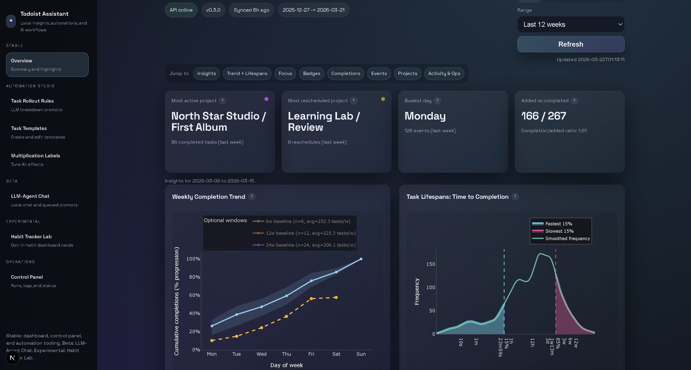
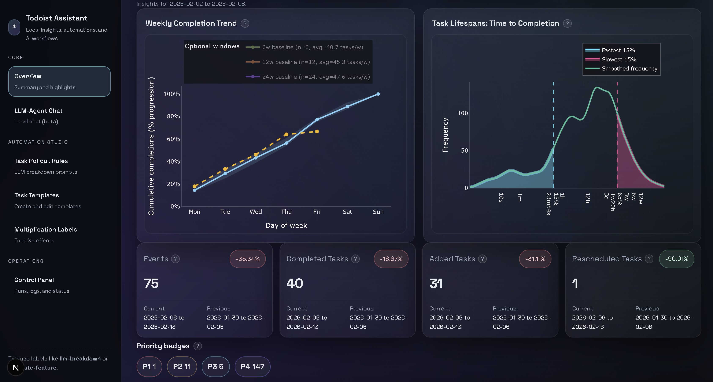
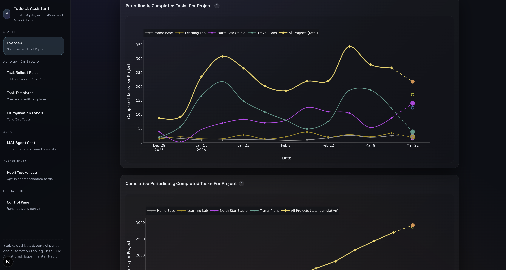

<div align="center">
  <table>
    <tr>
      <td align="center" width="180">
        <table border="1" cellpadding="8">
          <tr>
            <td align="center">
              
            </td>
          </tr>
        </table>
      </td>
      <td align="left">
        <h1>Todoist Assistant</h1>
        <p>Local-first analytics, automation, and a dashboard for Todoist data, plus optional AI summaries and read-only chat over cached activity. Sync once, analyze and automate repeatedly.</p>
        <p><strong>Quick links</strong><br/>
          <a href="docs/README.md">Docs index</a><br/>
          <a href="docs/INSTALLATION.md">Installation</a><br/>
          <a href="docs/USAGE.md">Usage</a><br/>
          <a href="docs/BUILDING.md">Build and CI</a><br/>
          <a href="docs/windows_installer.md">Windows installer</a><br/>
          <a href="docs/gmail_setup.md">Gmail setup</a>
        </p>
      </td>
    </tr>
  </table>
</div>

## Highlights
- Fast, local dashboard from your cached Todoist data (reproducible analytics, works offline after sync).
- Guided first-run setup with token validation and project hierarchy cleanup.
- Automations you can enable: task multiplication, local-only LLM breakdown, and an observer loop.
- Read-only chat over cached activity for summaries and insights (no writes to Todoist).

## Python library (what you can do)
The Python package is meant for **local-first data access** and **automation**:
- Read and cache Todoist activity via the API client and database layer.
- Run analytics helpers (stats, activity utilities).
- Build automations and observer loops on top of cached data.
- (Optional) Use AI helpers and agent tools for summaries and chat.

Basic import:
```python
import todoist
```

### Structure (where things live)
- `todoist` - public package (core modules + helpers).
- `todoist.api` - Todoist API client.
- `todoist.database` - local data store and persistence helpers.
- `todoist.automations` - automation workflows (observer, gmail, templates).
- `todoist.llm` - AI/LLM helpers.
- `todoist.agent` - agent tools and chat helpers.
- `todoist.web` - FastAPI app + web API surface.
- `todoist.dashboard` - plots + dashboard utilities.

### Core package notes (from `core/README.md`)
- Install editable core-only package:
  - `uv pip install -e core`
- Build wheel + sdist:
  - `uv build core`
- Included: `todoist.api`, `todoist.database`, `todoist.types`, `todoist.utils`, activity helpers, automation bases.
- Excluded: dashboard + web stack, plotting, LLM/agent modules, UI-only automations.

See `core/README.md` for full details.

## Screenshots




## Quick start (dev)
```bash
cp .env.example .env
# set API_KEY in .env
make init_local_env
make run_dashboard
```
Open:
- Frontend: http://127.0.0.1:3000
- API: http://127.0.0.1:8000

## Installation (end users)
- **Windows:** use `TodoistAssistantSetup.exe` from Releases (recommended). MSI details in [docs/windows_installer.md](docs/windows_installer.md).
- **macOS:** DMG for the full app; pkg/Homebrew for CLI-only. See [docs/INSTALLATION.md](docs/INSTALLATION.md).
- **Linux:** source setup only. See [docs/INSTALLATION.md](docs/INSTALLATION.md).

## First run (what it looks like)
- The app opens with a guided setup overlay.
- Step 1: paste your Todoist API token. It validates immediately and shows a connection sanity check (masked token + label count).
- Step 2: optional project adjustments (map archived projects to active roots). This can be edited later in Control Panel → Project Adjustments.
- You can always change the token later in Control Panel → Settings.
- After setup, the first data sync starts and a progress overlay appears while charts are generated (can take a few minutes on large accounts).

## Contributing
Issues and PRs are welcome. See [docs/BUILDING.md](docs/BUILDING.md) for build structure and CI workflows.

## License
MIT. See [LICENSE](LICENSE).
