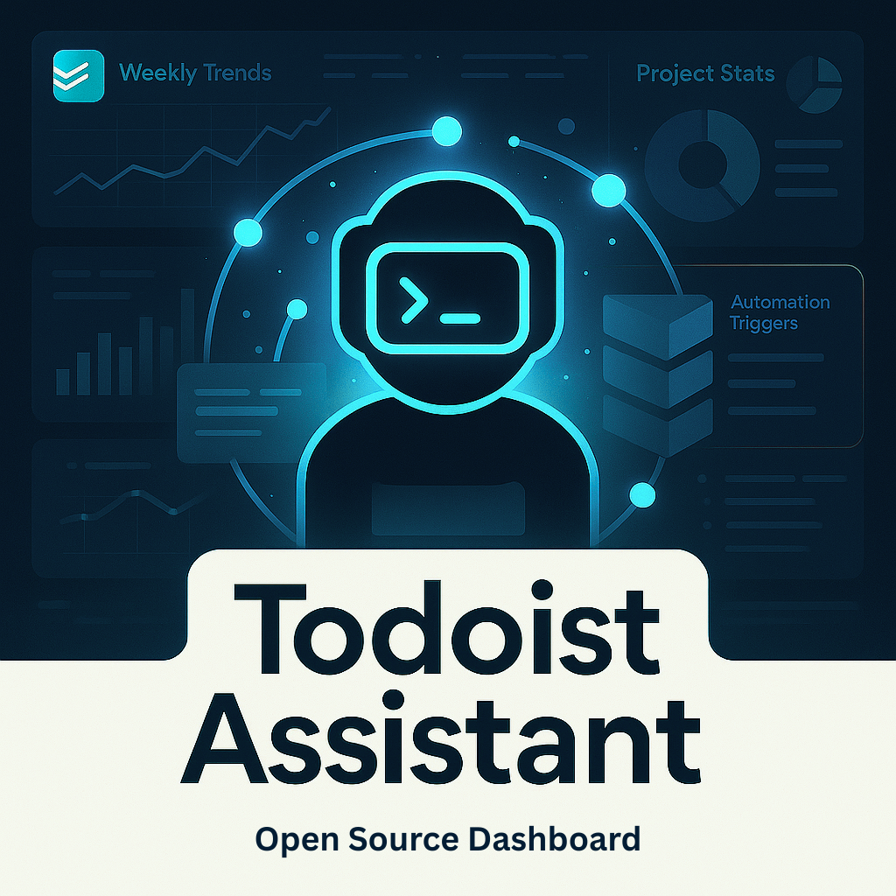
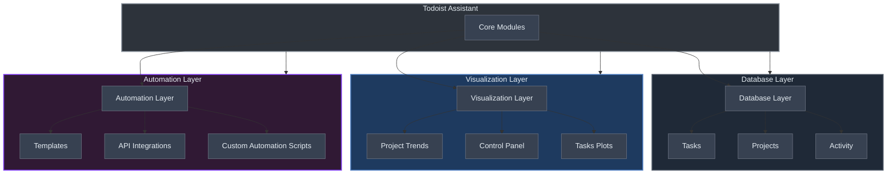
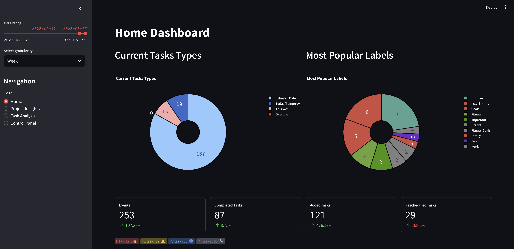
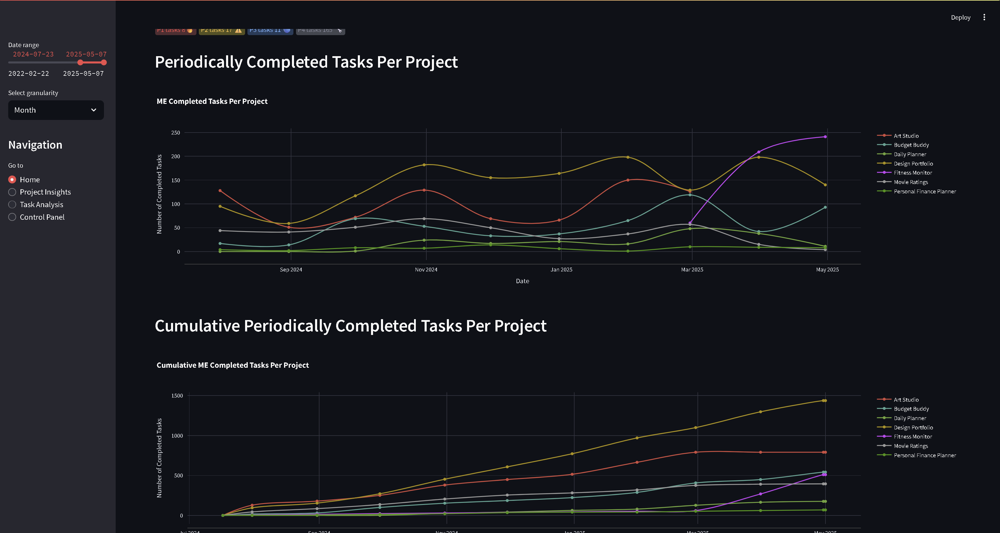
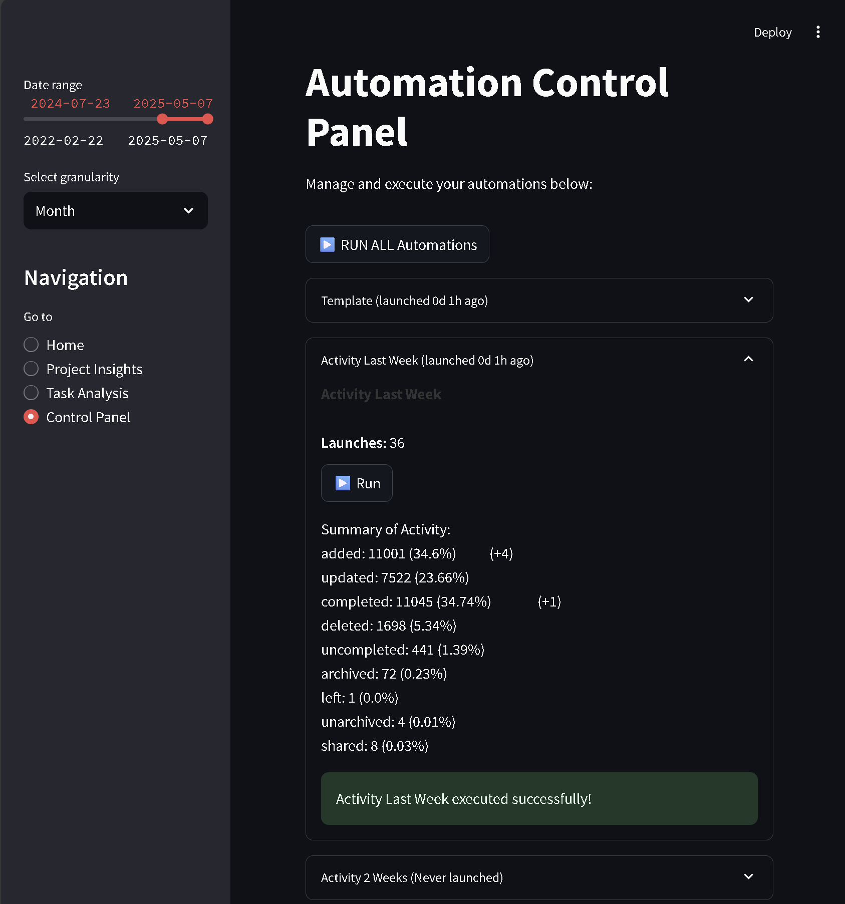

# Todoist Assistant

<table>
  <tr>
    <td style="text-align: justify; vertical-align: top;">
      <strong>Todoist Assistant</strong> is a python locally based tool designed to interact with the Todoist API. It fetches project and task data, generating insightful reports and statistics to help you track productivity trends. It offers the following key features: <br><br>
      1. <strong>Well-written Python library:</strong> Easily fetch, manage, and modify Todoist data, including activities, projects, and events. <br>
      2. <strong>Interactive plots:</strong> Visualize productivity trends and history (far beyond Todoist's default 4-week bar charts). Analyze data such as task label distributions or productivity trends from the creation of your Todoist account. <br>
      3. <strong>Automations:</strong> Automate repetitive tasks like rolling out templates based on specific labels.
    </td>
    <td style="text-align: center; vertical-align: top;">
      
    </td>
  </tr>
</table>

## Table of Contents
- [Library Design Overview](#library-design-overview)
- [Demo Video](#demo-video)
- [Installation](#installation)
  - [Recommended Setup Environment](#recommended-setup-environment)
  - [Setup Instructions (Linux / Ubuntu / Debian)](#setup-instructions-linux--ubuntu--debian)
- [Makefile Usage (recommended)](#makefile-usage-recommended)
- [Manual Usage](#manual-usage)
  - [Updating Activity Database](#updating-activity-database)
  - [Automatons Manual launch](#automatons-manual-launch)
  - [Dashboard Usage](#dashboard-usage)
  - [Background Observer](#background-observer)

## Library Design Overview


The Todoist Assistant is designed to interact seamlessly with the Todoist API, providing modular functionalities for automation, data visualization, and productivity insights. Below is a high-level diagram and explanation of the system's architecture and key ideas.



- **Separation of Concerns:**  
  Each module handles a specific task—fetching data, processing it, or visualizing results—so you can easily swap out or extend functionality without touching the core.

- **Core Modules:**    
  - **Database Module:**  
    Acts as the intermediary between the Todoist API and your app. It’s subdivided into:
    - *Projects:* Manage active/archived projects.
    - *Tasks:* Add, delete, or template-insert tasks.
    - *Activity:* Gathers and aggregates Todoist events such as task additions, deletions, and completions.
  - **Dashboard & Plots:**  
    Use Streamlit to build interactive dashboards. The Plots module transforms raw data into engaging visualizations that showcase productivity trends.
  - **Automations:**
    Automations allow custom triggers and actions like fetching activity, apply templates, ...
  - **Integrations** *(experimental)*   
    Integrations open the door to connect with external services like Twitter or Gmail. The Gmail Tasks automation can automatically create Todoist tasks from actionable emails.
  - **Agentic AI Module** *(incoming)*
    Summarizes activity logs into actionable insights, provides on-demand or daily productivity snapshots, detects trends like peak hours or bottlenecks, tracks progress toward goals, supports plain-language queries, and tailors reports by projects, labels, or timeframes.

<div style="text-align: center;">
  
  
</div>

## Demo Video

[](https://www.youtube.com/watch?v=e_-EOyAq6mU)

[Watch the demo on YouTube](https://www.youtube.com/watch?v=e_-EOyAq6mU)

## Installation
### Recommended Setup Environment

> **Note for windows:** While the Todoist-Stats-App can be used on Windows, it is highly recommended to set it up in a Linux environment for the best experience.  
> If you are on Windows, consider installing [Ubuntu 20.04 (WSL)](https://learn.microsoft.com/en-us/windows/wsl/install) to get started with a Linux subsystem.


### Setup Instructions (Linux / Ubuntu / Debian)

1. **Install Python 3**

   Make sure Python 3 is installed on your system.  
   On Ubuntu/Debian, you can install it via:
   ```bash
   sudo apt update
   sudo apt install -y python3 libpq-dev
   ```

2. **Install Required Tools**

   - [Git](https://git-scm.com/)
   - [Make](https://askubuntu.com/a/272020) (for Makefile support)
   - [UV (Python package manager)](https://github.com/astral-sh/uv)
   - **Node.js 20+ + npm** (for the new Next.js dashboard in `frontend/`)
     - Recommended via `nvm`:
       ```bash
       curl -fsSL https://raw.githubusercontent.com/nvm-sh/nvm/v0.39.7/install.sh -o /tmp/install_nvm.sh
       bash /tmp/install_nvm.sh
       source ~/.nvm/nvm.sh
       nvm install 20
       nvm use 20
       ```

3. **Clone and Set Up the Repository**

   ```bash
   git clone https://github.com/mtyrolski/todoist-assistant.git
   cd todoist-assistant
   # Set up the Python environment & dependencies
   uv run python3 -c "print('packages installed')"
   cp .env.example .env
   # Open .env file (copy)
   nano .env
   # Inside a .env file, edit your configuration and access key
   API_KEY = 'your_todoist_api_key'
   ```
   then do `ctrl + x` --> `y` --> `enter` to save the file.
   Where to find **Todoist API Key**? 
   `Go to App --> Settings --> Integrations --> Developer --> API token --> Copy API token`

4. **Setup Todoist Assistant**
   Launch initialization of the local environment which will fetch your tasks, events and projects from last 10 years (can take a few minutes).
   ```bash
   make init_local_env
   ```

5. **(Optional) In case of any fetching error, you can setup env from beginning using two steps**
  Clear and setup local env from beinning.
  ```bash
  make clear_local_env
  make init_local_env
  ```

1. **(Optional) Update your local env from make**
    If you want to update your local environment (from shell instead of control panel) with the latest activity data + run templates and label-based automations on your todoist account, you can run:
    ```bash
    make update_env
    ```

## Makefile Usage (recommended)

The following [Makefile](Makefile) commands are available for managing the local environment and running the dashboard:

- **`make init_local_env`:** Initializes the local environment by syncing history and fetching activity (Only during first run).
- **`make install_app`:** Installs frontend dependencies in `frontend/` (requires Node.js + npm).
- **`make run_dashboard`:** Launches the new web dashboard stack (FastAPI API + Next.js frontend).
- **`make run_dashboard_streamlit`:** Launches the legacy Streamlit dashboard.
- **`make run_api`:** Runs the FastAPI backend only (http://127.0.0.1:8000).
- **`make run_frontend`:** Runs the Next.js dev server only (http://127.0.0.1:3000).
- **`make run_observer`:** Runs the background observer that refreshes recent activity, resets local caches, and triggers short automations (templates, multiply, etc.) every 30 seconds.
- **`make clear_local_env`:** Clears local environment data by removing the activity cache.


## Manual Usage

### Updating Activity Database

Fetch and update your Todoist activity data:
```bash
python3 -m todoist activity --nweeks N_WEEKS
```

This command retrieves, summarizes, and saves the latest activity data locally.

### Automatons Manual launch

This line launches all automations defined in `configs/automations.yaml`. Update or add own config for customization.
```
python3 -m todoist.automations.run --config-dir configs --config-name automations
```

### Background Observer

Keep the short automations running continuously against fresh activity data:
```
python3 -m todoist.automations.run_observer --config-dir configs --config-name automations
```
This entrypoint pulls the latest week of activity, updates the cached events, refreshes the local database view, and then runs the non-activity automations so multipliers/templates don’t re-expand already-processed tasks.

### Dashboard Usage

#### New web dashboard (recommended)

1. Make sure your Python env is ready and `.env` is configured (Todoist API token).
2. Install the frontend dependencies:
```bash
make install_app
```
3. Start the full dashboard stack:
```bash
make run_dashboard
```
Then open:
- Frontend: http://127.0.0.1:3000
- API: http://127.0.0.1:8000 (health: `/api/health`)

#### Legacy Streamlit dashboard

To run the legacy Streamlit dashboard, execute:
```bash
make run_dashboard_streamlit
```
<table>
  <tr>
    <td style="text-align: justify; vertical-align: top;">
      The Streamlit UI aggregates and displays data retrieved from the Todoist API. You can navigate to Control Panel to launch automations in GUI.
    </td>
    <td style="text-align: center; vertical-align: top;">
      
    </td>
  </tr>
</table>

### Library Integration

Integrate Todoist-Assistant into your projects using the provided API. Here are some examples:

**Fetching activity**
```python
from todoist.types import Event, is_event_rescheduled
from todoist.database.base import Database

dbio = Database('.env') # Initialize the database connection (in fact, bridge to local cached data and connection to Todoist API)
# Fetch events from Todoist API with 5 weeks
activity: list[Event] = dbio.fetch_activity(max_pages=5)
len(activity)
```
*1324*

```python
n_reschedules = sum(map(is_event_rescheduled, activity))
print(f"Number of rescheduled events: {n_reschedules} ( {(round(n_reschedules / len(activity) * 100, 2))}% )")
```

*Querying activity data: 6page [00:00, 2818.12page/s]*
*Number of rescheduled events: 186 ( 14.05% )*

**Inserting tasks**
```python
from todoist.types import Project

projects: list[Project] = dbio.fetch_projects(include_tasks=True)
dbio.insert_task(content='Buy milk', project_id=projects[0].id) # Insert a new task into the first project
```

**Create mapping to play with your todoist history**
```python
project_name_to_tasks = {
    project.project_entry.name: project.tasks for project in projects
}
```
See source files to full capabilities:
- [todoist/database/base.py](todoist/database/base.py)
- [todoist/database/dataframe.py](todoist/database/base.py)
- [todoist/database/db_activity.py](todoist/database/base.py)
- [todoist/database/db_labels.py](todoist/database/base.py)
- [todoist/database/db_projects.py](todoist/database/base.py)
- [todoist/database/db_tasks.py](todoist/database/base.py)


### Custom Automations

Extend Todoist-Assistant with custom automation scripts. Automations define actions triggered by Todoist events, enhancing data processing before visualization.

**Automation Configuration.** The `automations.yaml` file defines the available automations that can be executed either through the dashboard control panel or via manual command-line launches.
**Configuration Structure.** The configuration file (`configs/automations.yaml`) defines several types of automations:

```yaml
automations:
  # Task templates for creating structured sets of tasks
  - _target_: todoist.automations.template.Template
    task_templates:
      # Call template with preparation and follow-up subtasks
      call:
        content: Call
        description: Call someone
        children:
          -
            content: Setup meeting
            description: Should be put on calendar.
            due_date_days_difference: -3
          -
            content: Prepare content for a meeting
            description: Prepare notes and bullet points to cover.
            due_date_days_difference: -1

      # Paper reading workflow template
      read_paper:
        content: Read Paper
        description: Read a research paper
        children:
          # Child tasks omitted for brevity...

  
  # Activity tracking automations for different time periods
  - _target_: todoist.automations.activity.Activity
    name: Activity Last Week
    nweeks: 1
  - _target_: todoist.automations.activity.Activity
    name: Activity Last Month
    nweeks: 4
...
```
The template loader automatically applies sane defaults (priority 1 and a same-day `due_date_days_difference` of `0`) and wraps
each entry into a `TaskTemplate`, so the YAML examples above do not need `_target_` blocks for every task or subtask.

- `Template` automation will transform all tasks marked with labels `@template-call` by attaching specified subtasks, `read_paper` and other templates similarly. See [todoist/automations/template.py](todoist/automations/template.py) for details.
- `Activity` fetches all events from specific time range. See [todoist/automations/activity.py](todoist/automations/activity.py) for details.
- Similarly other automations defined in (todoist/automations)[todoist/automations] folder can be enhanced or inspected and even implemented new ones by inheritance with base automation [todoist/automations/base.py](todoist/automations/base.py).

## Gmail Tasks Automation *(experimental)*

The Gmail Tasks automation automatically creates Todoist tasks from actionable emails. This feature:

- Monitors your Gmail for unread emails containing actionable keywords
- Creates corresponding tasks in Todoist with appropriate context and priority
- Avoids creating duplicate tasks
- Runs automatically at configurable intervals

**Setup**: See [Gmail Setup Guide](docs/gmail_setup.md) for detailed configuration instructions.

**Keywords detected**: `todo`, `action required`, `follow up`, `deadline`, `urgent`, `reminder`, `task`, `meeting`, `schedule`, and more.

**Created tasks include**:
- Email subject as task content
- Sender information and email preview in description  
- Priority based on urgency keywords
- `gmail-task` label for easy identification

## Configuration

### Aligning Archive Projects


Map archived projects to active ones for accurate stats and reporting. This step is essential because the Todoist API does not automatically link archived projects to their respective parent or related active projects. Without this alignment, the statistics and insights derived from the data could become fragmented and misleading. By manually mapping these relationships, we ensure a comprehensive and accurate representation of productivity trends and task history. Perhaps in future it will be somehow automated (contributions are welcome!).

```python
link_adjustments = {
    'Old Project 0': 'Current active root project',
    'Old Project 1 ⚔️': 'Current active root project',
    'Old Project 2': 'Another active project 🔥⚔️🔥',
    'Old Project 3': 'An old master archive project'
}
```

For example, in the statistics, `Old Project 1` will be reflected under the correct active project (`Current active root project`). Archived projects will no longer appear as standalone entities, making the reports cohesive and more insightful.

## Contributing

Contributions are welcome! Open an issue or submit a pull request with improvements or new features.

## License

This project is licensed under the MIT License. See [LICENSE](LICENSE) for details.
