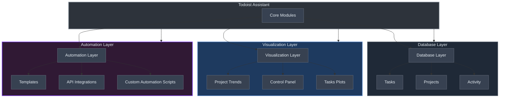

# Todoist Assistant

<table>
  <tr>
    <td style="text-align: justify; vertical-align: top;">
      <strong>Todoist Assistant</strong> is a Python-based locally based tool designed to interact with the Todoist API. It fetches project and task data, generating insightful reports and statistics to help you track productivity trends. It offers the following key features: <br><br>
      1. <strong>Well-written Python library:</strong> Easily fetch, manage, and modify Todoist data, including activities, projects, and events. <br>
      2. <strong>Interactive plots:</strong> Visualize productivity trends and history (far beyond Todoist's default 4-week bar charts). Analyze data such as task label distributions or productivity trends from the creation of your Todoist account. <br>
      3. <strong>Automations:</strong> Automate repetitive tasks like rolling out tasks based on specific labels.
    </td>
    <td style="text-align: center; vertical-align: top;">
      
    </td>
  </tr>
</table>

## Library Design Overview


The Todoist Assistant is designed to interact seamlessly with the Todoist API, providing modular functionalities for automation, data visualization, and productivity insights. Below is a high-level diagram and explanation of the system's architecture and key ideas.



- **Separation of Concerns:**  
  Each module handles a specific task—fetching data, processing it, or visualizing results—so you can easily swap out or extend functionality without touching the core.

- **Core Modules:**    
  - **Database Module:**  
    Acts as the intermediary between the Todoist API and your app. It’s subdivided into:
    - *Projects:* Manage active/archived projects.
    - *Tasks:* Add, delete, or template-insert tasks.
    - *Activity:* Gathers and aggregates Todoist events such as task additions, deletions, and completions.
  - **Dashboard & Plots:**  
    Use Streamlit to build interactive dashboards. The Plots module transforms raw data into engaging visualizations that showcase productivity trends.
  - **Automations & Integrations:**
    Automations allow custom triggers and actions like fetching activity, apply templates, ...
  - **Integrations** *(experimental)*   
    Integrations open the door to connect with external services like Twitter or Gmail.
  - **Agentic AI Module** *(incoming)*
    Summarizes activity logs into actionable insights, provides on-demand or daily productivity snapshots, detects trends like peak hours or bottlenecks, tracks progress toward goals, supports plain-language queries, and tailors reports by projects, labels, or timeframes.

<div style="text-align: center;">
  
  
</div>

## Makefile Usage (recommended)

The following [Makefile](Makefile) commands are available for managing the local environment and running the dashboard:

- **`make init_local_env`:** Initializes the local environment by syncing history and fetching activity.
- **`make run_dashboard`:** Launches the Streamlit dashboard for Todoist Assistant.
- **`make clear_local_env`:** Clears local environment data by removing the activity cache.


## Manual Usage

### Installation
```bash
git clone https://github.com/mtyrolski/todoist-assistant.git
cd todoist-assistant
# Set up environment
poetry shell
poetry install
echo "API_KEY=your_todoist_api_key" > .env
```

### Updating Activity Database

Fetch and update your Todoist activity data:
```bash
python3 -m todoist activity --nweeks N_WEEKS
```

This command retrieves, summarizes, and saves the latest activity data locally.

### Automatons Manual launch

This line launches all automations defined in `configs/automations.yaml`. Update or add own config for customization.
```
python3 -m todoist.automations.run --config-dir configs --config-name automations
```

### Dashboard Usage

To run the dashboard, execute the following command:
```bash
streamlit run dashboard.py
```
<table>
  <tr>
    <td style="text-align: justify; vertical-align: top;">
      This command starts a Streamlit application that aggregates and displays data retrieved from the Todoist API. The dashboard processes inputs such as active projects, archived projects, and activity events. You can also navigate to Control Panel to launch automations in GUI.
    </td>
    <td style="text-align: center; vertical-align: top;">
      
    </td>
  </tr>
</table>

### Library Integration

Integrate Todoist-Assistant into your projects using the provided API. Here are some examples:
```python
from datetime import datetime, timedelta
from typing import List
import os

# Import necessary modules from the library
from todoist.database.base import Database
from todoist.types import Project, Event, _Task_API_V9 as TaskEntry

# Initialize the database with path to your .env file
# The .env file should contain your API_KEY
db = Database(dotenv_path=".env")

# Add a new task to a project
task_id = db.insert_task(
    content="Review Pull Requests",
    project_id="2345678901",  # Replace with your actual project ID
    due_date="2025-05-01",
    priority=3,  # 3 = Medium priority in Todoist
    labels=["work", "coding"]
)
print(f"New task created: {task_id}")

# Create a task template and insert it with overrides
task_template = TaskEntry(
    id="template_task",
    content="Daily stand-up meeting",
    project_id="2345678901",
    priority=2,
    labels=["work", "meetings"],
    description="Discuss project progress and blockers",
)

# Insert the task from template with some overrides
result = db.insert_task_from_template(
    task=task_template,
    due_date="2025-05-01",
    content="Special stand-up meeting",
    priority=3
)
print(f"Task inserted from template: {result}")

# Fetch projects data
db.pull()  # This ensures project data is loaded

# List all active projects
projects: List[Project] = db.projects_cache
print("Active Projects:")
for proj in projects:
    print(f" - {proj.project_entry.name} (ID: {proj.id})")

# Fetch a specific project by its identifier
project: Project = db.fetch_project_by_id("2345678901")
print(f"Fetched project: {project.project_entry.name}, Archived: {project.is_archived}")

# List archived projects
archived_projects: List[Project] = db.fetch_archived_projects()
print("Archived Projects:")
for proj in archived_projects:
    print(f" - {proj.project_entry.name} (ID: {proj.id})")

# Get label colors
label_colors = db.fetch_label_colors()
print("Label Colors:")
for label_name, color_code in label_colors.items():
    print(f" - {label_name}: {color_code}")

# Retrieve activity logs and filter events
activity_data: List[Event] = db.fetch_activity()

# Filter for completed events
completed_events: List[Event] = [
    evt for evt in activity_data if evt.event_entry.event_type == "completed"
]
print(f"Number of completed events: {len(completed_events)}")

# Filter activity events from the last 14 days
cutoff_date: datetime = datetime.utcnow() - timedelta(days=14)
recent_events: List[Event] = [
    evt for evt in activity_data if evt.date >= cutoff_date
]
print(f"Events in the last 2 weeks: {len(recent_events)}")
```

### Custom Automations

Extend Todoist-Assistant with custom automation scripts. Automations define actions triggered by Todoist events, enhancing data processing before visualization.

**Automation Configuration.** The `automations.yaml` file defines the available automations that can be executed either through the dashboard control panel or via manual command-line launches.
**Configuration Structure.** The configuration file (`configs/automations.yaml`) defines several types of automations:

```yaml
automations:
  # Task templates for creating structured sets of tasks
  - _target_: todoist.automations.template.Template
    task_templates:
      # Call template with preparation and follow-up subtasks
      call:
        _target_: todoist.automations.template.TaskTemplate
        content: Call
        description: Call someone
        due_date_days_difference: 0
        priority: 1
        children:
          - _target_: todoist.automations.template.TaskTemplate
            content: Setup meeting
            description: Should be put on calendar.
            due_date_days_difference: -3
          - _target_: todoist.automations.template.TaskTemplate
            content: Prepare content for a meeting
            description: Prepare notes and bullet points to cover.
            due_date_days_difference: -1
          # Additional child tasks omitted for brevity...
      
      # Paper reading workflow template
      read_paper:
        _target_: todoist.automations.template.TaskTemplate
        content: Read Paper
        description: Read a research paper
        due_date_days_difference: 0
        priority: 1
        children:
          # Child tasks omitted for brevity...

  
  # Activity tracking automations for different time periods
  - _target_: todoist.automations.activity.Activity
    name: Activity Last Week
    nweeks: 1
  - _target_: todoist.automations.activity.Activity
    name: Activity Last Month
    nweeks: 4
...
  
  # Task multiplication automation
  - _target_: todoist.automations.multiplicate.Multiply
```

## Configuration

### Aligning Archive Projects

Map archived projects to active ones for accurate stats:
```python
link_adjustments = {
    'Old Project 1 ⚔️': 'Current active root project',
    'Old Project 2': 'Another active project 🔥⚔️🔥'
}
```

## Contributing

Contributions are welcome! Open an issue or submit a pull request with improvements or new features.

## License

This project is licensed under the MIT License. See [LICENSE](LICENSE) for details.
