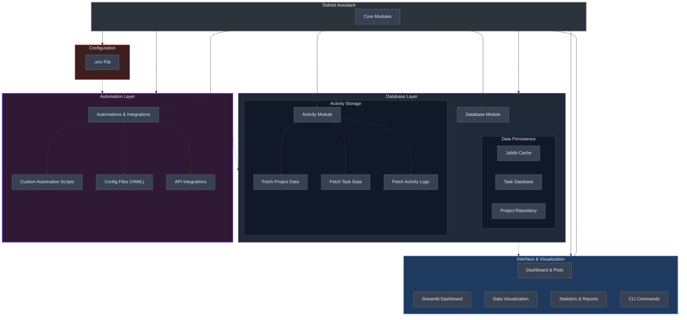

# Todoist Assistant

Todoist Assistant is a Python-based tool designed to interact with the Todoist API. It fetches project and task data, generating insightful reports and statistics to help you track productivity trends.

## Library Design Overview


The Todoist Assistant is designed to interact seamlessly with the Todoist API, providing modular functionalities for automation, data visualization, and productivity insights. Below is a high-level diagram and explanation of the system's architecture and key ideas.



- **Separation of Concerns:**  
  Each module handles a specific task—fetching data, processing it, or visualizing results—so you can easily swap out or extend functionality without touching the core.

- **Core Modules:**
  - **Activity Module:**  
    Gathers and aggregates Todoist events such as task additions, deletions, and completions.
  - **Database Module:**  
    Acts as the intermediary between the Todoist API and your app. It’s subdivided into:
    - *Projects:* Manage active/archived projects.
    - *Tasks:* Add, delete, or template-insert tasks.
    - *Activity:* Log and update event data.
  - **Dashboard & Plots:**  
    Use Streamlit to build interactive dashboards. The Plots module transforms raw data into engaging visualizations that showcase productivity trends.
  - **Automations & Integrations:** *(experimental)*  
    Automations allow custom triggers and actions, while integrations open the door to connect with external services like Twitter or Gmail.

## Makefile Usage (recommended)

The following `Makefile` commands are available for managing the local environment and running the dashboard:

```makefile
.PHONY: init_local_env run_dashboard

init_local_env: # syncs history, fetches activity
	poetry run python3 -m todoist.automations.init_env --config-dir configs --config-name automations

run_dashboard:
	PYTHONPATH=. poetry run streamlit run todoist/dashboard/app.py

clear_local_env:
	rm -f activity.joblib
```

- **`init_local_env`:** Initializes the local environment by syncing history and fetching activity.
- **`run_dashboard`:** Launches the Streamlit dashboard for Todoist Assistant.
- **`clear_local_env`:** Clears local environment data by removing the activity cache.


## Manual Usage

### Installation
```bash
git clone https://github.com/mtyrolski/todoist-assistant.git
cd todoist-assistant
# Set up environment
poetry shell
poetry install
echo "API_KEY=your_todoist_api_key" > .env
```

### Updating Activity Database

Fetch and update your Todoist activity data:
```bash
python3 -m todoist activity --nweeks N_WEEKS
```

This command retrieves, summarizes, and saves the latest activity data locally.

### Automatons Manual launch

This line launches all automations defined in `configs/automations.yaml`. Update or add own config for customization.
```
python3 -m todoist.automations.run --config-dir configs --config-name automations
```

### Dashboard Usage

To run the dashboard, execute the following command:
```bash
streamlit run dashboard.py
```

This command starts a Streamlit application that aggregates and displays data retrieved from the Todoist API. The dashboard processes inputs such as active projects, archived projects, and activity events.

Navigate to Control Panel to launch automations in GUI.

### Library Integration

Integrate Todoist-Assistant into your projects using the provided API. Here are some examples:
```python
from datetime import datetime, timedelta
from typing import List
from todoist.database import Database
from todoist.types import Project, Event

db: Database = Database()

# Add a new task to "Daily Tasks"
task_id: int = db.add_task(
    project_name="Daily Tasks",
    content="Review Pull Requests",
    due_date="2025-03-25"
)
print(f"New task created with ID: {task_id}")

# Insert a task from a template for recurring tasks
db.insert_task_from_template(
    template_name="daily-checklist",
    insert_date="2025-04-01",
    project_name="Daily Tasks"
)
print("Task inserted from template.")

# List all active projects
projects: List[Project] = db.list_projects()
print("Projects:")
for proj in projects:
    print(f" - {proj.name} (ID: {proj.id})")

# Fetch a specific project by its identifier
project: Project = db.db_projects.fetch_project_by_id("123456789")
print(f"Fetched project: {project.project_entry.name}, Archived: {project.is_archived}")

# List archived projects with historical data
archived_projects: List[Project] = db.db_projects.fetch_archived_projects()
print("Archived Projects:")
for proj in archived_projects:
    print(f" - {proj.project_entry.name} (ID: {proj.id})")

# Retrieve activity logs and filter events
activity_data: List[Event] = db.db_activity.fetch_activity()

# Filter for completed events
completed_events: List[Event] = [
    evt for evt in activity_data if evt.event_entry.event_type == "completed"
]
print(f"Number of completed events: {len(completed_events)}")

# Filter activity events from the last 14 days
cutoff_date: datetime = datetime.utcnow() - timedelta(days=14)
recent_events: List[Event] = [
    evt for evt in activity_data if evt.date >= cutoff_date
]
print(f"Events in the last 2 weeks: {len(recent_events)}")
```

### Custom Automations

Extend Todoist-Assistant with custom automation scripts. Automations define actions triggered by Todoist events, enhancing data processing before visualization.


## Configuration

### Aligning Archive Projects

Map archived projects to active ones for accurate stats:
```python
link_adjustments = {
    'Old Project 1 ⚔️': 'Current active root project',
    'Old Project 2': 'Another active project 🔥⚔️🔥'
}
```

## Contributing

Contributions are welcome! Open an issue or submit a pull request with improvements or new features.

## License

This project is licensed under the MIT License. See [LICENSE](LICENSE) for details.