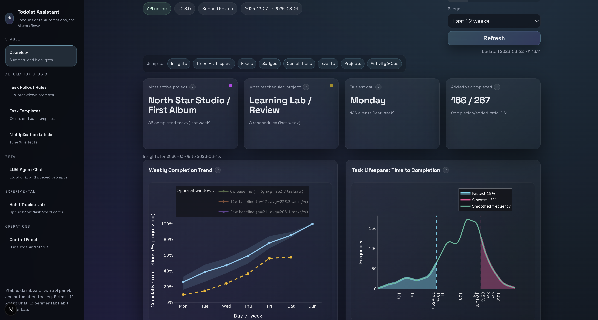

# Todoist Assistant

Todoist Assistant is a local dashboard and small automation toolkit for Todoist.
It keeps a local activity cache, shows what changed, and helps turn an overloaded
task list into a clear next step.

The v0.4 development branch deliberately keeps the product small:

- Dashboard for activity, priorities, project hierarchy, and completion trends
- Task Multiplication for splitting labelled work into a finite set of copies
- Optional Gmail import and observer sync
- An on-demand, read-only Codex executive review of cached activity and active projects

It does not provide task templates, AI task breakdown, persistent AI context,
personal AI chat, or an Android client.



## Quick start

Requirements: Python 3.11, [uv](https://docs.astral.sh/uv/), Node.js 20+, and a
Todoist API token.

```bash
git clone https://github.com/mtyrolski/todoist-assistant.git
cd todoist-assistant
cp .env.example .env
# Set API_KEY in .env
make setup
make dashboard
```

Open the dashboard at <http://127.0.0.1:3000>.

Useful commands:

```bash
make dashboard         # normal dashboard; no Codex request
make dashboard_codex   # enables the on-demand executive review
make update_env        # refresh local Todoist data
make run_observer      # keep cache and short automations current
make test_all          # complete test suite
```

The executive review is requested only when its button is used. It sends a compact
snapshot derived from `activity.joblib` and active projects to the local Codex CLI
in read-only mode; it never changes Todoist. It compares the last week with the
previous week, considers completion timing and project concentration, and recommends
one focused next-flow. The project-contribution chart complements it with a direct
parent-project/subproject completion timeline.

## Scope and data

The dashboard uses the local cache after sync. Todoist is contacted to refresh that
cache, not for routine chart rendering. Keep `.env` private: it contains your
Todoist token. The default dashboard does not require Codex. To use the review,
install and authenticate the Codex CLI, then start `make dashboard_codex`.

## Project layout

- `todoist/` — Python application, cache, API, dashboard and automations
- `frontend/` — Next.js dashboard
- `configs/` — dashboard and automation configuration
- `core/` — core-only Python package
- `tests/` — unit, API, integration, and packaging checks

## Packaging

Windows and macOS packaging remains supported; see [Windows installer notes](docs/windows_installer.md).
There is no Android build or release target.

## Verification

```bash
uv sync --locked
make check_fast
make test_all
```

For focused frontend checks:

```bash
npm --prefix frontend run lint
npm --prefix frontend run build
```
