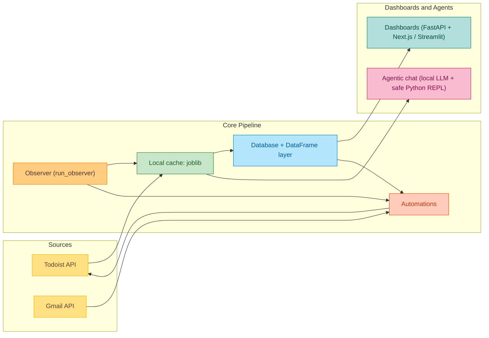

# Todoist Assistant

<table>
  <tr>
    <td style="text-align: justify; vertical-align: top;">
      <strong>Todoist Assistant</strong> is a local-first, Python-based system for reproducible analysis and automation on Todoist data. It synchronizes projects, tasks, and activity into local caches and exposes a modular stack for analytics, visualization, and automation. Key capabilities: <br><br>
      1. <strong>Python library:</strong> Fetch, manage, and update Todoist data (activities, projects, events) with a clean API. <br>
      2. <strong>Interactive plots:</strong> Visualize long-horizon productivity trends beyond the default 4-week views. <br>
      3. <strong>Automations:</strong> Apply task templates and label-driven workflows. <br>
      4. <strong>Agentic chat (local, read-only):</strong> Ask natural-language questions over cached activity with structured outputs.
    </td>
    <td style="text-align: center; vertical-align: top;">
      
    </td>
  </tr>
</table>

## Table of Contents
- [Todoist Assistant](#todoist-assistant)
  - [Table of Contents](#table-of-contents)
  - [How It Works](#how-it-works)
    - [Screenshots](#screenshots)
  - [Library Design Overview](#library-design-overview)
  - [Installation](#installation)
    - [Recommended Setup Environment](#recommended-setup-environment)
    - [Setup Instructions (Linux / Ubuntu / Debian)](#setup-instructions-linux--ubuntu--debian)
  - [Makefile Usage (recommended)](#makefile-usage-recommended)
  - [Manual Usage](#manual-usage)
    - [Updating Activity Database](#updating-activity-database)
    - [Automations Manual Launch](#automations-manual-launch)
    - [Agentic Chat (local)](#agentic-chat-local)
    - [Background Observer](#background-observer)
    - [Dashboard Usage](#dashboard-usage)
      - [New web dashboard (recommended)](#new-web-dashboard-recommended)
    - [Library Integration](#library-integration)
    - [Custom Automations](#custom-automations)
  - [Gmail Tasks Automation *(experimental)*](#gmail-tasks-automation-experimental)
  - [Configuration](#configuration)
    - [Aligning Archive Projects](#aligning-archive-projects)
  - [Contributing](#contributing)
  - [License](#license)

## How It Works

- **Local cache (joblib):** `todoist.utils.Cache` persists `activity.joblib` plus automation/integration metadata and Gmail processed IDs. Most analytics read from these files after the initial sync, so repeated runs stay fast and reproducible.
- **Database layer:** `todoist.database.Database` composes Activity/Projects/Tasks/Labels mixins on top of `TodoistAPIClient`. It keeps in-memory caches for projects/tasks and uses retry logic for API calls.
- **Activity ingestion:** `fetch_activity_adaptively` walks backward in time windows until it hits empty windows, merging into the cached event set. This avoids re-downloading years of activity on every run.
- **DataFrame pipeline:** `todoist.database.dataframe.load_activity_data` converts cached events to pandas, joins project metadata, and applies `personal/*.py` mappings (`link_adjustements`) so archived root projects roll up correctly.
- **Automations + observer:** Automations are instantiated via Hydra from `configs/automations.yaml`. `todoist.run_observer` polls recent activity every 30s, refreshes the cache, resets DB caches, and triggers short automations (templates, multipliers, etc.).
- **Dashboard stack:** FastAPI (`todoist.web.api`) refreshes data on a 60s TTL and serves Plotly payloads to the Next.js UI. `make run_demo` enables anonymized project/label names for sharing.
- **Agentic chat:** `todoist.agent` runs a LangGraph pipeline (instruction selection -> planning -> tool execution) with a safe, read-only Python REPL that blocks imports and filesystem writes. It only reads cached `events` and `events_df`.

### Screenshots
<div style="text-align: center;">
  
  
  
</div>

## Library Design Overview


Todoist Assistant is organized as a local-first analytics pipeline. The core idea is to sync Todoist data into local caches
once, then run repeatable analysis, automations, and dashboards on top. The stack is modular so you can use just the library,
just the dashboard, or just the automations without rewriting the data layer.



At a glance, the Database layer wraps the Todoist API, hydrates in-memory caches, and standardizes project/task/activity
models. The DataFrame pipeline turns cached activity into a pandas timeline that powers plots and dashboards. Automations
are config-driven classes that either extend tasks (templates) or refresh activity data on a schedule. The agentic chat
layer is optional and runs fully local, using cached events with a restricted Python REPL for analysis.


## Installation
### Recommended Setup Environment

> **Windows:** recommended via [Ubuntu 20.04 (WSL)](https://learn.microsoft.com/en-us/windows/wsl/install) for the best experience.


### Setup Instructions (Linux / Ubuntu / Debian)

1. **Install Python 3**
   ```bash
   sudo apt update
   sudo apt install -y python3 libpq-dev
   ```

2. **Install Required Tools**

   - [Git](https://git-scm.com/)
   - [Make](https://askubuntu.com/a/272020) (for Makefile support)
   - [UV (Python package manager)](https://github.com/astral-sh/uv)
   - **Node.js 20+ + npm** (for the Next.js dashboard in `frontend/`)
     - Recommended via `nvm`:
       ```bash
       curl -fsSL https://raw.githubusercontent.com/nvm-sh/nvm/v0.39.7/install.sh -o /tmp/install_nvm.sh
       bash /tmp/install_nvm.sh
       source ~/.nvm/nvm.sh
       nvm install 20
       nvm use 20
       ```

3. **Clone and Set Up the Repository**

   ```bash
   git clone https://github.com/mtyrolski/todoist-assistant.git
   cd todoist-assistant
   cp .env.example .env
   nano .env
   API_KEY = 'your_todoist_api_key'
   ```
   API token: App -> Settings -> Integrations -> Developer -> API token.

4. **Setup Todoist Assistant**
   Initialize the local cache (may take a few minutes).
   ```bash
   make init_local_env
   ```

5. **(Optional) Reset local cache**
   ```bash
   make clear_local_env
   make init_local_env
   ```

6. **(Optional) Update local cache + automations**
   ```bash
   make update_env
   ```

## Makefile Usage (recommended)

The following [Makefile](Makefile) commands are available:

- **`make init_local_env`:** Initialize local cache (first run).
- **`make install_app`:** Install frontend deps.
- **`make run_dashboard`:** Run API + frontend (auto-installs deps).
- **`make run_demo`:** Run anonymized dashboard.
- **`make run_api`:** Run FastAPI backend (http://127.0.0.1:8000).
- **`make run_frontend`:** Run Next.js dev server (http://127.0.0.1:3000).
- **`make run_observer`:** Run observer loop (refresh + automations).
- **`make clear_local_env`:** Remove activity cache.
- **`make chat_agent`:** Start local agentic chat over cached activity.


## Manual Usage

### Updating Activity Database

Fetch and update your Todoist activity data:
```bash
python3 -m todoist.activity --nweeks N_WEEKS
```

### Automations Manual Launch

Launch all automations defined in `configs/automations.yaml` (long-running automations are skipped).
```
python3 -m todoist.automations.run --config-dir configs --config-name automations
```

### Agentic Chat (local)

Read-only analysis over cached activity using a local LLM, structured outputs, and a restricted Python REPL.
The tool loads cached `activity.joblib` into `events` and `events_df` and blocks file or network access.

```bash
make chat_agent
```

Manual invocation:
```bash
PYTHONPATH=. uv run python -m todoist.agent.chat --model-id "mistralai/Ministral-3-3B-Instruct-2512"
```

Env vars: `TODOIST_AGENT_MODEL_ID`, `TODOIST_AGENT_CACHE_PATH`, `TODOIST_AGENT_INSTRUCTIONS_DIR`, `TODOIST_AGENT_DEVICE`, `TODOIST_AGENT_DTYPE`, `TODOIST_AGENT_TEMPERATURE`, `TODOIST_AGENT_TOP_P`, `TODOIST_AGENT_MAX_NEW_TOKENS`, `TODOIST_AGENT_MAX_TOOL_LOOPS`.

### Background Observer

Keep the short automations running continuously against fresh activity data:
```
python3 -m todoist.run_observer --config-dir configs --config-name automations
```
This entrypoint polls recent activity every 30s, refreshes the cache, and runs non-activity automations.

### Dashboard Usage

#### New web dashboard (recommended)

1. Make sure your Python env is ready and `.env` is configured (Todoist API token).
2. Install the frontend dependencies (first run only; `make run_dashboard` will also do this automatically):
```bash
make install_app
```
3. Start the full dashboard stack:
```bash
make run_dashboard
```
Or run an anonymized demo session:
```bash
make run_demo
```
Then open:
- Frontend: http://127.0.0.1:3000
- API: http://127.0.0.1:8000 (health: `/api/health`)

The web dashboard includes an Admin panel for automations, logs, and project adjustment mappings.

### Library Integration

Integrate Todoist-Assistant into your projects using the provided API. Here are some examples:

**Fetching activity**
```python
from todoist.types import Event, is_event_rescheduled
from todoist.database.base import Database

dbio = Database(".env")
activity: list[Event] = dbio.fetch_activity(max_pages=5)
len(activity)
```

```python
n_reschedules = sum(map(is_event_rescheduled, activity))
print(f"Number of rescheduled events: {n_reschedules} ( {(round(n_reschedules / len(activity) * 100, 2))}% )")
```

**Inserting tasks**
```python
from todoist.types import Project

projects: list[Project] = dbio.fetch_projects(include_tasks=True)
dbio.insert_task(content='Buy milk', project_id=projects[0].id) # Insert a new task into the first project
```
See source files to full capabilities:
- [todoist/database/base.py](todoist/database/base.py)
- [todoist/database/dataframe.py](todoist/database/dataframe.py)
- [todoist/database/db_activity.py](todoist/database/db_activity.py)
- [todoist/database/db_labels.py](todoist/database/db_labels.py)
- [todoist/database/db_projects.py](todoist/database/db_projects.py)
- [todoist/database/db_tasks.py](todoist/database/db_tasks.py)


### Custom Automations

Extend Todoist-Assistant with custom automation scripts. Automations are defined in `configs/automations.yaml` and can be executed from the dashboard or CLI.

```yaml
automations:
  - _target_: todoist.automations.template.Template
    task_templates:
      call:
        content: Call
        description: Call someone
        children:
          - content: Setup meeting
            due_date_days_difference: -3
  - _target_: todoist.automations.activity.Activity
    name: Activity Last Week
    nweeks: 1
```
The template loader applies defaults (priority 1, `due_date_days_difference=0`) and wraps entries into `TaskTemplate`.

- `Template` expands tasks labeled `template-<name>` (for example `template-call`; see [todoist/automations/template/automation.py](todoist/automations/template/automation.py)).
- `LLMBreakdown` expands tasks labeled `llm-<variant>` into hierarchical subtasks using the local LLM (variants configured in [configs/automations.yaml](configs/automations.yaml); implementation in [todoist/automations/llm_breakdown/automation.py](todoist/automations/llm_breakdown/automation.py)).
- `Activity` fetches events for a time range (see [todoist/automations/activity/automation.py](todoist/automations/activity/automation.py)).
- Other automations live in [todoist/automations](todoist/automations).

## Gmail Tasks Automation *(experimental)*

The Gmail Tasks automation creates Todoist tasks from actionable emails (experimental).

- Monitors unread Gmail messages and extracts actionable items.
- Creates Todoist tasks with context and priority, avoiding duplicates.

**Setup**: See [Gmail Setup Guide](docs/gmail_setup.md).

## Configuration

### Aligning Archive Projects


Map archived projects to active ones for accurate stats. The Todoist API does not link archived projects to their active parents, so reports can fragment without this mapping. Mappings live in `personal/*.py` (by default `personal/archived_root_projects.py`) and must define `link_adjustements` (note the spelling).

```python
link_adjustements = {
    "Old Project 0": "Current active root project",
    "Old Project 1": "Current active root project",
    "Old Project 2": "Another active project",
    "Old Project 3": "An old master archive project",
}
```

Archived projects then roll up under the mapped active project in reports.

## Contributing

Contributions are welcome! Open an issue or submit a pull request with improvements or new features.

## License

This project is licensed under the MIT License. See [LICENSE](LICENSE) for details.
